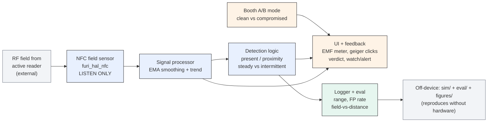
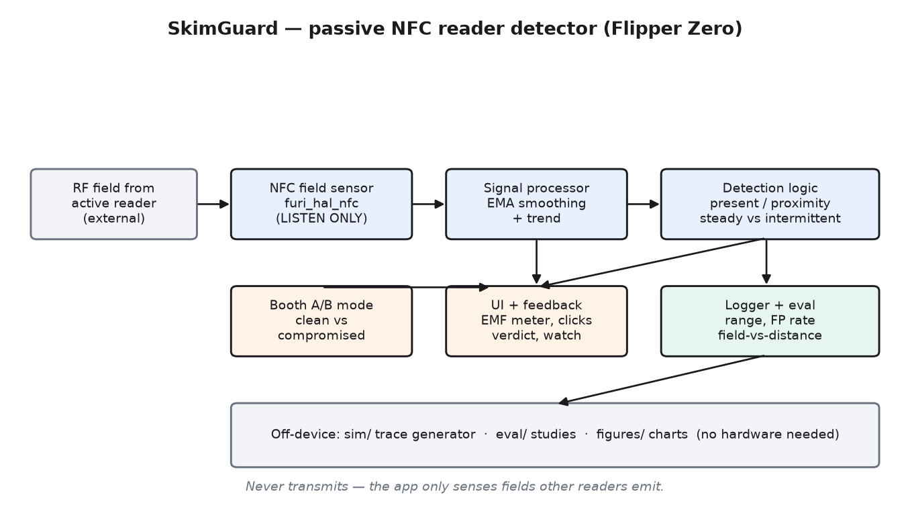
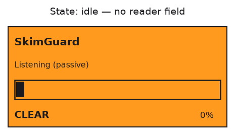
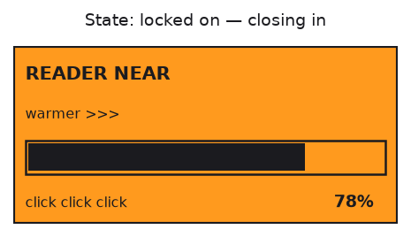
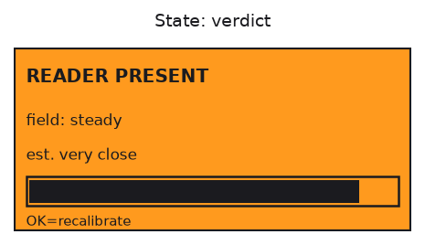
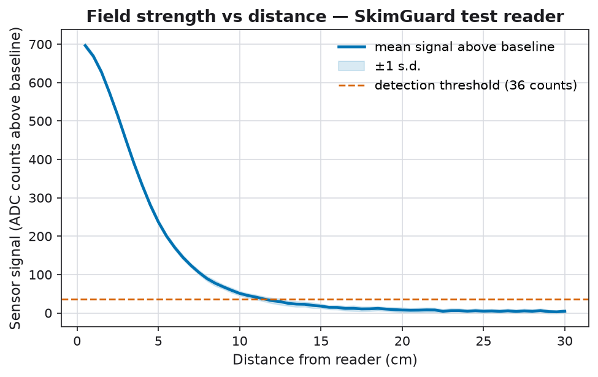
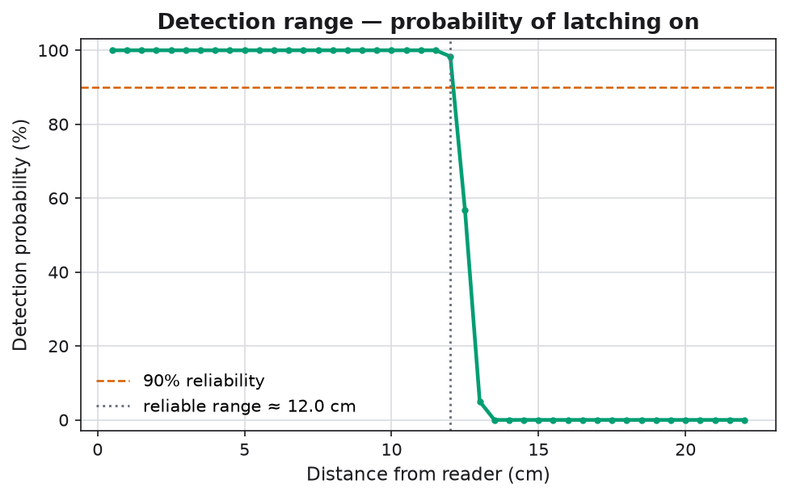
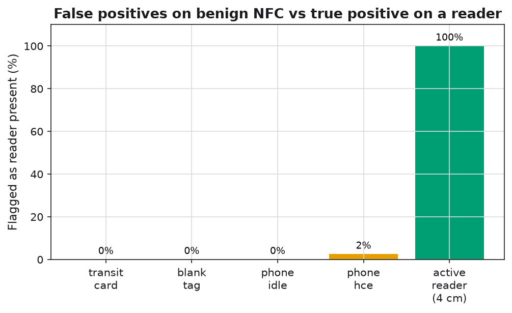
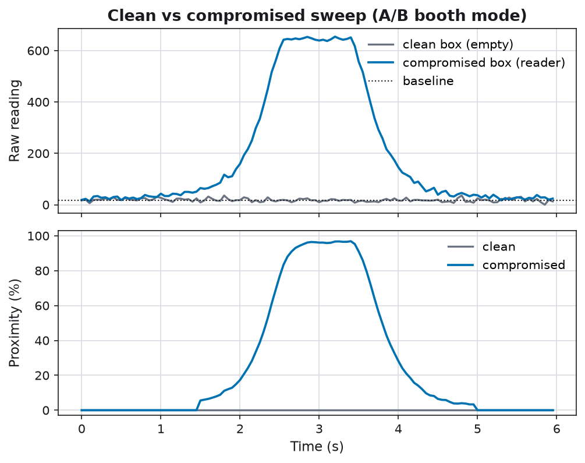
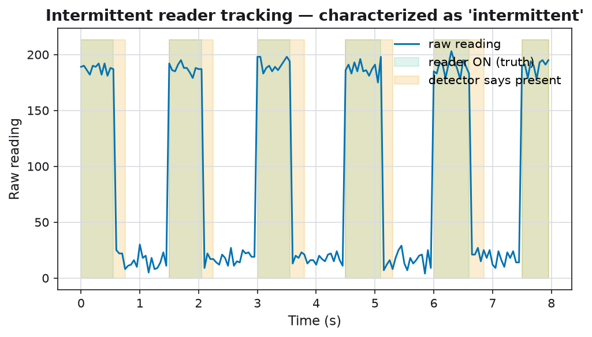

# SkimGuard

**A passive 13.56 MHz NFC reader (skimmer) detector for the Flipper Zero — it
listens for the RF field a powered reader can't help but emit, and never
transmits anything itself.**

> One-line pitch: wave the Flipper near a hidden card reader and SkimGuard turns
> the reader's own RF emissions into a find-it-yourself bug sweep — an
> accelerating "geiger" click and a rising meter as you close in — plus a
> measured evaluation of how far it reaches and where it fails.

**Author / sole contributor:** Krishita Sanjay Choksi. This project is authored
and maintained by Krishita Sanjay Choksi as the **sole contributor**; there are
no other contributors.

---

## Honest positioning (read this first)

SkimGuard does **not** invent the technique it uses. Passively detecting a
powered 13.56 MHz reader by sensing its field is an established idea, most
visibly implemented by the open-source **Specter** project for the Flipper Zero.
SkimGuard is an **independent implementation** of that approach, with two things
added on top:

1. a **measurement / evaluation layer** (detection range, false-positive rate,
   field-strength-vs-distance — all code-generated and reproducible), and
2. a **physical-security-control framing** (rogue-reader detection mapped to
   recognized controls).

It does not claim novelty for the sensing approach, and it cannot identify the
exact device it detects. Full credit and scope: [`docs/prior_art.md`](docs/prior_art.md).

---

## Why it exists

Card skimmers hide inside ATMs, gas pumps, and payment terminals. A skimmer that
reads a card has to **power a 13.56 MHz field** to do it — and a powered reader
emits that field continuously, whether or not a card is present. SkimGuard is a
**receive-only** bug sweep: it senses that field and turns it into a live
warmer/colder meter so you can locate a hidden reader **without transmitting
anything yourself**. Detecting rogue readers is a real physical-security control
(see [Physical-security relevance](#physical-security-relevance)).

---

## Architecture



Rendered copy (code-generated by `python -m eval.make_diagrams`):



| Component | Role |
|---|---|
| **NFC field sensor** (`src/field_sensor.c`) | Passive read of the external field via `furi_hal_nfc`. Never energizes a field. Only hardware-specific file. |
| **Signal processor** (`src/detection.c`) | EMA smoothing + a slow-EMA trend for warmer/colder. |
| **Detection logic** (`src/detection.c`) | Present/absent with noise-relative hysteresis, proximity estimate, steady-vs-intermittent characterization. |
| **UI + feedback** (`src/skimguard.c`) | EMF meter, accelerating clicks, verdict, A/B mode, watch/alert mode. |
| **Simulator** (`sim/`) | Physically-motivated field model → traces, so everything runs with no Flipper. |
| **Evaluation** (`eval/`) | Runs the reference detector over traces and generates all figures. |

The reference detector in `eval/detector.py` is a line-for-line mirror of the
firmware in `src/detection.c` (shared constants in `src/skimguard_config.h`), so
the off-device evaluation characterizes exactly what runs on the device.

---

## The 60-second demo

Hide a powered NFC reader in one of two identical boxes; leave the other empty.
Hand someone the Flipper: they sweep the empty box (quiet), then the other one —
the clicks accelerate and the meter climbs until they find the reader
themselves. Then open the box: *"it gave itself away, because a powered reader is
always emitting — and this only listens."*

Full script, setup, controls, and failure recovery: [`docs/demo_guide.md`](docs/demo_guide.md).

### On-device UI states (mockups)

| Idle — clear | Locked on | Verdict |
|---|---|---|
|  |  |  |

*(These are code-generated mockups of the 128×64 screen, not hardware photos.)*

### Controls

| Button | Action |
|---|---|
| Left / Right | switch mode: **Sweep · A/B · Watch** |
| OK | Sweep: recalibrate here · A/B: next step · Watch: arm/disarm |
| Up / Down | toggle click sound |
| Back | exit |

---

## Install

### Build the `.fap` with ufbt

```bash
pip install ufbt
ufbt            # builds dist/skimguard.fap
ufbt launch     # build + upload to a connected Flipper + run
```

### Or drag-and-drop with qFlipper

Copy `dist/skimguard.fap` to `SD Card/apps/NFC/`, then open **Apps → NFC →
SkimGuard** on the device.

### Hardware-free demo build

```bash
ufbt FAP_CFLAGS="-DSKIMGUARD_SIM"   # replays a synthetic sweep; shows a SIM marker
```

Full build notes, including the single firmware integration point, are in
[`build/BUILD.md`](build/BUILD.md).

---

## Reproduce the evaluation (no hardware)

```bash
python -m venv .venv && source .venv/bin/activate
pip install -r requirements.txt

make figures     # runs the study + regenerates every figure below
make test        # C detection tests + Python tests
```

Everything is seeded, so a clean clone reproduces the exact numbers.

### Results (seed 7, typical desktop USB reader)

| Metric | Value |
|---|---|
| Reliable detection range (P ≥ 90%) | **12.0 cm** |
| Marginal range (P ≥ 50%) | 12.5 cm |
| True-positive rate (active reader @ 4 cm) | 100% |
| Overall false-positive rate (benign NFC) | 0.6% |
| Intermittent tracking precision / recall | 0.77 / 1.00 |

Full table and per-device breakdown: [`docs/eval_results.md`](docs/eval_results.md).

| | |
|---|---|
|  |  |
|  |  |



> The numbers above come from the simulator's field model — they characterize the
> **detector logic** end-to-end and reproduce anywhere. Swap in your own captured
> logs (`data/real_logs/`) to characterize your specific hardware; the same
> detector and plots run on both.

---

## Capabilities & limits

| SkimGuard **detects** | SkimGuard **does not** detect |
|---|---|
| Powered **13.56 MHz** NFC readers currently emitting | **125 kHz** low-frequency prox readers (out of scope) |
| Present / absent + estimated proximity | The **exact device** (make/model) |
| Steady vs intermittent field | A reader that is **off, asleep, or shielded** at sweep time |
| — passively, never transmitting | Purely **mechanical** attacks (card traps, overlays, cameras) |

> **A quiet reading means "nothing emitting a 13.56 MHz field right now." It is
> not a certificate that a terminal is clean.** Absence of a detection is not
> proof of absence of a skimmer. Full threat model: [`docs/threat_model.md`](docs/threat_model.md).

---

## Physical-security relevance

Sweeping for rogue/unauthorized readers is a **physical-security control**, not a
gadget trick. It maps onto recognized control families:

- **NIST SP 800-53 (PE — Physical & Environmental Protection):** monitoring for
  unauthorized devices near assets; physical inspection of equipment.
- **PCI DSS Requirement 9 (9.5.x):** periodic inspection of POS/payment devices
  for tampering and substitution — a reader sweep operationalizes that check.

This framing connects the tool to GRC/audit practice: the same reasoning that
puts badge access and camera coverage on an audit checklist puts rogue-reader
detection there too.

---

## Responsible use

SkimGuard is **defensive and receive-only** — no transmit, replay, emulation, or
attack path exists in the code. Use it only to sweep equipment and spaces you
**own or are authorized to assess**. Do not sweep other people's cards, badges,
or devices, and never present a quiet reading as a guarantee that a real-world
terminal is safe.

---

## Repository layout

```
skim-guard/
├── application.fam          Flipper app manifest
├── src/                     the .fap: field sensor, signal proc, detection, UI
├── sim/                     hardware-free trace simulator (+ CLI)
├── eval/                    reference detector, measurement studies, plots
├── data/                    synthetic traces + de-identified real-log format
├── figures/                 code-generated charts, architecture, UI mockups
├── tests/                   host C tests + Python tests
├── docs/                    threat_model.md · prior_art.md · demo_guide.md · eval_results.md
└── build/                   ufbt build notes + firmware integration point
```

---

## License

MIT © 2026 Krishita Sanjay Choksi. See [`LICENSE`](LICENSE). Citation metadata in
[`CITATION.cff`](CITATION.cff).
